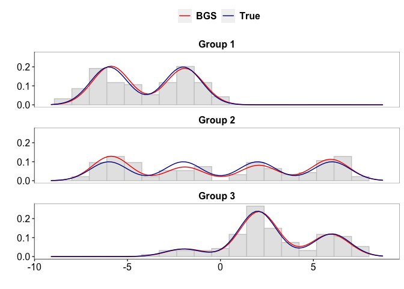

Blocked Gibbs sampler for hierarchical Dirichlet processes
================

Implementation of sampling algorithm presented in the paper, Das, S.,
Niu, Y., Ni, Y., Mallick, B.K., and Pati, D. (2023+) “Blocked Gibbs
sampler for hierarchical Dirichlet processes”.

## Overview

Posterior computation in hierarchical Dirichlet process (HDP) mixture
models is an active area of research in nonparametric Bayes inference of
grouped data. We develop a blocked Gibbs sampler to sample from the
posterior distribution of HDP under a univariate conjugate Gaussian
mixture model, which produces statistically stable results, is highly
scalable with respect to sample size, and is shown to have good mixing.

## Main Functions

- **BGS.R** - Functions to implement the blocked Gibbs algorithm. The
  function `blocked_gibbs` performs posterior sampling using our
  proposed blocked Gibbs sampler.

- **rejectionsampler.R** - Functions to implement the rejection sampling
  algorithm for sampling the unnormalized global weights in our blocked
  Gibbs algorithm.

### Additional Functions

- **CRF.R** - Functions to implement the Chinese restaurant franchise
  (CRF) ([Teh et al.,
  2006](https://people.eecs.berkeley.edu/~jordan/papers/hdp.pdf)) based
  collapsed Gibbs algorithm. The function `CRF_gibbs` performs posterior
  sampling using the CRF scheme.

- **SS.R** - Functions to implement the exact slice sampler ([Amini et
  al., 2019](https://arxiv.org/abs/1903.08829)). Code taken from
  [aaamini/hdpslicer](https://github.com/aaamini/hdpslicer/blob/master/hdp_inference.R)
  with minor modifications for fitting a univariate conjugate Gaussian
  mixture model. The function `hdp_slice_sampler` implements the exact
  slice sampler.

- **postestimates.R** - Functions to get posterior estimates of cluster
  labels using the least squares clustering method ([Dahl,
  2006](https://dahl.byu.edu/papers/dahl-2006.pdf)) and evaluate the
  log-likelihood of the Gaussian mixture model using posterior samples.

## Example

Letting $j$ denote groups and $i$ denote observations within a group, we
consider J = 3 groups with equal sample sizes $n_j = 100$ under a
Gaussian mixture model having 4 true components.

- True cluster means : $\phi = (−6, −2, 2, 6)$.

- Mixture weights : $\pi_1 = (0.5, 0.5, 0, 0)$,
  $\pi_2 = (0.25, 0.25, 0.25, 0.25)$ and $\pi_3 = (0, 0.1, 0.6, 0.3)$.

- Densities :
  $f_j(y) = \Sigma_{k=1}^4 \, \pi_{jk} \ \mathcal{N}(y\,;\phi_k, \tau^{-1})$,
  $y \in R$.

- True cluster labels : $z_{ji} \sim \pi_j$

- Observations : $x_{ji} \sim \mathcal{N}(\phi_{z_{ji}}, \tau^{-1})$

**Other specifications** :

- Prior on $\phi$ : $\mathcal{N}(\xi, \lambda^{-1})$, $\xi = 0$,
  $\lambda=1$.

- Prior on $\alpha_0$ : Gamma $(\gamma, b_0)$, $\gamma = 1$,
  $b_0 = 0.1$.

- Truncation level : $L=10$.

**Data generation** :

``` r
library(mcclust)
source("BGS.R")
source("postestimates.R")

# Generate data 
J = 3; L = 4; n = rep(100, J)
xi = 0; lambda = 1 ; tau = 1

# True cluster means
phi.true = c(-6, -2, 2, 6)

# True mixture weights
Pi1 = c(0.5, 0.5, 0, 0); Pi2 = rep(1/L, L); Pi3 = c(0, 0.1, 0.6, 0.3);
Pi.true = rbind(Pi1, Pi2, Pi3)

# True cluster labels
true.Z = vector(mode = "list", length = J)

# Observations in each group is stored as a list
# x[[j]] denotes observations in the jth group
x = vector(mode = "list", length = J)
for(j in 1:J){
  true.Z[[j]] = sample(1:L, size = n[j], prob = Pi.true[j, ], replace = TRUE)
  x[[j]] = sapply(1:n[j], function(i) 
    rnorm(n = 1, mean = phi.true[true.Z[[j]][i]], sd = sqrt(1/tau)))
}
```

Specify the hyperparameters :

``` r
# Number of MCMC samples and Burn in period.
M = 1000; M.burn = 500

# parameter specifications
G = 0.1; B = 0.1; L.max = 10

# grid points for density estimation
xmin = min(unlist(x)) - 1 ; xmax = max(unlist(x)) + 1
y.grid = seq(xmin, xmax, length = 100)

# run the blocked gibbs sampler
out_BGS = blocked_gibbs(x = x, L.max = L.max, gam = G, phi.param = c(xi, lambda, tau), 
                        b0 = B, Burn.in = M.burn, M = M, est.density = TRUE,y.grid = y.grid)
```

Posterior estimates of cluster labels are obtained using Dahl’s method.

``` r
# get BGS clusters using Dahl's method
Z.hat = getDahl(out_BGS)
```

**Plots showing the true and estimated cluster labels** :

``` r
# data frame for plotting cluster labels
clusters = lapply(seq_len(J), function(j) 
  data.frame("X" = x[[j]], "True" = as.character(true.Z[[j]]), "BGS" = as.character(Z.hat[[j]]) ))

# function to plot true and estimated clusters for the jth group
plot_clusters = function(j, clusters){
  
  plot.title = paste("Group",j)
  # plot true clusters
  g.true = ggplot() + labs(x = "", y = "", title = plot.title) + ylim(xmin, xmax) +
    geom_point(data = clusters[[j]], size = 1,
             mapping = aes(x = 1:nrow(clusters[[j]]), y = X, colour = True)) + themegg
  
  g.hat = ggplot() + labs(x = "", y = "", title = plot.title) + ylim(xmin, xmax) +
    geom_point(data = clusters[[j]], size = 1,
             mapping = aes(x = 1:nrow(clusters[[j]]), y = X, colour = BGS)) + themegg
  
  return(list(g.true = g.true, g.hat = g.hat))
}
g1 = plot_clusters(1, clusters)
g2 = plot_clusters(2, clusters)
g3 = plot_clusters(3, clusters)

ggarrange(g1$g.true, g1$g.hat, g2$g.true, g2$g.hat, g3$g.true, g3$g.hat, ncol=2, nrow = 3)
```

<!-- -->

The adjusted Rand index between the true and BGS cluster labels :

``` r
# Global adjusted Rand index
ARI.global = mcclust::arandi(unlist(Z.hat), unlist(true.Z))
ARI.global
```

    ## [1] 0.922978

``` r
# Group specific adjusted Rand indices
ARI = sapply(seq_len(J), function(j) arandi(Z.hat[[j]], true.Z[[j]]))
ARI
```

    ## [1] 1.0000000 0.8471121 0.9005652

We estimate the densities for each group.

``` r
# True density for each group
true.density = matrix(NA, nrow = J, ncol = 100)
for(j in 1:J){
  
  # evaluate the density for each group
  true.density[j, ] = sapply(1:100, function(ii) 
    sum( Pi.true[j, ] * dnorm(y.grid[ii], mean = phi.true, sd = sqrt(1/tau)) ))
}

# Estimated densities using posterior samples
dens.BGS = lapply(1:M, function(m) out_BGS[[m]]$density)
est.dens = Reduce("+", dens.BGS)/M
```

**Plots showing the true and estimated densities for each group overlaid
on the histograms of the observed data** :

``` r
# data frames for plotting histograms and densities
dat_hist = data.frame(x = unlist(x), group = rep(c("Group 1", "Group 2", "Group 3"), each = n[1]))
dens = c(cbind(t(true.density), t(est.dens)))
dat_dens = data.frame(grid = y.grid, density = dens, method = rep(c("True", "BGS"), each = 3*100), group = rep(c("Group 1", "Group 2", "Group 3"), each = 100, times = 2))

# plot the histograms for each group
g.hist = ggplot(dat_hist, aes(x = x))  +
  geom_histogram(color="grey80", fill="grey90", aes(y=after_stat(density)), bins = 20)+
  facet_wrap(~as.factor(group), ncol = 1) + xlim(xmin, xmax) + themegg

# overlay the histograms with density plots
g.hist + geom_line(dat_dens, mapping = aes(x = grid, y = density, color = method, size = method)) +
  scale_size_manual(values = c(True = 0.5, BGS = 0.5))+
  scale_color_manual(values=c("dodgerblue3", "sienna"))+ 
  labs(x = "", y = "") + guides(size = guide_legend(nrow = 1)) +
  theme(legend.position = "top", legend.title=element_blank()) + themegg
```

<!-- -->
